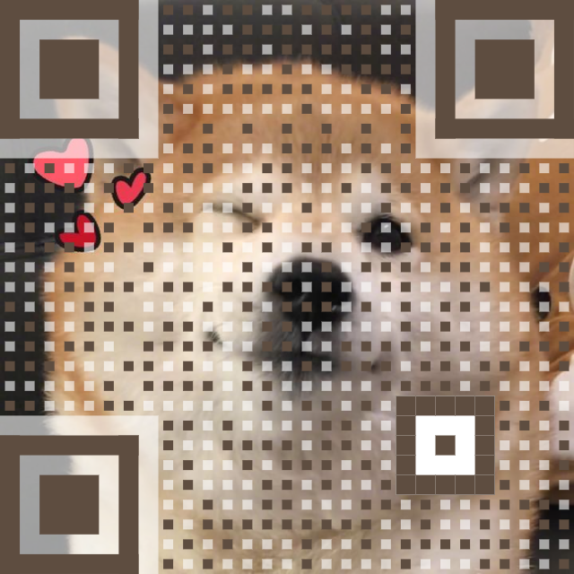

# wx-qr

 

## 介绍

基于[Awesome-qr.js](https://github.com/SumiMakito/Awesome-qr.js)修改开发，并能够完美适配微信小程序的二维码组件。

## 样例

<table>
	<tr>
		<td valign="top"></td>
    <td valign="top"></td>
    <td valign="top"></td>
  </tr>
</table>

## 仓库地址

* [码云地址](https://gitee.com/liu_di/wx-qr)
* [github](https://github.com/liuxdi/wx-qr)

## 开发及测试环境

* 微信小程序基础库：2.15.0
* 开发者工具版本：1.05.2112172

## 预览

[微信开发者工具打开](https://developers.weixin.qq.com/s/G3naeTm67SvY)

## 安装

### 方法一：通过 npm 安装（推荐）

```bash
# 通过 npm 安装
npm i wx-qr -S

# 通过 yarn 安装
yarn add wx-qr

```

### 方法二：直接下载使用

通过 git 下载 wx-qr 源代码，并将根目录中的 `dist` 文件夹拷贝到自己的项目中去

```bash
git clone git@github.com:liuxdi/wx-qr.git
```

## 使用组件

首先在你所开发的小程序根目录 `app.json` 或需要使用该组件的 `xxx.json` 中引用组件

（注意：请不要将组件命名为 `wx-xxx` 开头，可能会导致微信小程序解析 tag 失败 ）

```json
{
  "usingComponents": {
    "qr-container": "wx-qr"
  }
}
```

之后就可以在 wxml 中直接使用组件

WXML

```html
<qr-container text="{{qrTxt}}" size="750"></qr-container>
```

js

```js
Page({
    data: {
        qrTxt: 'https://github.com/liuxdi/wx-qr',
    },
});
```

## 注意

本库二维码基于 `Canvas` 绘制，但由于微信小程序[众所周知的原因](https://developers.weixin.qq.com/community/develop/doc/00044ee36e04601f236971e5c50000?highLine=Canvas%2520is%2520not%2520a%2520constructor)不支持真机调试 `Canvas` ，只能通过开发者工具以及手机预览功能进行查看。

## API

### props

props中涉及到的属性，都是可选的，如果不传，则使用默认值。若是涉及大小的属性，不传单位则默认为 `rpx` 。

|        参数         |                                                 说明                                                  |          类型          | 默认值          |
| :-----------------: | :---------------------------------------------------------------------------------------------------: | :--------------------: | :-------------- |
|        text         |                                              二维码内容                                               | `String` | ''              |
|        size         |                                  二维码尺寸，若无单位，则默认为 rpx                                   | `'Number'\|'String'` | `200rpx` |
|      dotScale       |                                          每块二维码点的大小                                           | `Number` | `1` |
|   backgroundImage   |                                            二维码背景图片                                             | `String` | ''              |
|  backgroundDimming  |                                          背景图上掩膜的颜色                                           | `String` | `rgba(0,0,0,0)` |
|      logoImage      |                                        二维码中间的 logo 图片                                         | `String` | ''              |
|      logoScale      |                                       logo 图片占整个二维码比例                                       | `Number` | `0.2` |
|     logoMargin      |                           logo 图片距离二维码的距离, 若无单位，则默认为 rpx                            | `Number` | `0` |
|     canvasMode      |                             是否使用 canvas 绘制二维，默认以图片形式展示                              | `Boolean` | `false` |
| showMenuByLongpress |                                在canvasMode=false时，是否长按显示菜单                                 | `Boolean` | `true` |
|       margin        |                                  二维码边距，若无单位，则默认为 rpx                                   | `'Number' \| 'String'` | `10rpx` |
|    correctLevel     |             二维码纠错等级 [详见](https://www.qrcode.com/en/about/error_correction.html)              | `Number` | `0` |
|     maskPattern     | 二维码自定义掩码[详见](https://en.wikiversity.org/wiki/Reed%E2%80%93Solomon_codes_for_coders#Masking) | `Number` \| `null` | `null` |
|       version       |                    二维码版本[详见](https://www.qrcode.com/en/about/version.html)                     | `Number` \| `null` | `null` |
|     components      |                                        二维码中控制组件的选项                                         | `ComponentOptions` | `{}` |
|      colorDark      |                             二维码颜色，若设置此项，需将 `autoColor=false` | `String` | `#000000` |
|     colorLight      |                          二维码背景色，若设置此项，需将 `backgroundImage=''` | `String` | `#FFFFFF` |
|      autoColor      |                                   是否自动根据背景图配置二维码颜色                                    | `Boolean` | `false` |
|     whiteMargin     |                                   如果有margin的话是否展示白色的边                                    | `Boolean` | `false` |
|  logoCornerRadius   |                                 logo圆角大小，若无单位，则默认为 rpx                                  | `Number` | `0` |

ComponentOptions属性

```typescript
/*
  scale: 二维码指定区域中块的比例。
  protectors: 控制是否在二维码指定区域中绘制半透明保护。
*/

type ComponentOptions = {
  data?: {
    scale?: number;
  };
  timing?: {
    scale?: number;
    protectors?: boolean;
  };
  alignment?: {
    scale?: number;
    protectors?: boolean;
  };
  cornerAlignment?: {
    scale?: number;
    protectors?: boolean;
  };
};
```

### Events

| 事件名称 |                  说明                   |   返回   |
| :------: | :-------------------------------------: | :------: |
|   load   | 当二维码加载完成时触发, 返回文件临时目录 | `string` |
|  error   |         当二维码加载失败时触发          | 错误信息 |

### Methods

可以通过小程序API `selectComponent` 来获取到对应的组件实例，然后调用对应的方法。
例:

```html
<qr-container id="qr">
```
```js
const qrContainer = this.selectComponent('#qr');
console.log(qrContainer.getQrFile());
```

|  方法名称   |                   说明                   |   返回   |
| :---------: | :--------------------------------------: | :------: |
|  getQrFile  | 获取二维码图片，返回二维码的临时文件位置 | `string` |
| getQrBase64 |           获取二维码图片base64           | `string` |

## 说明

1. 微信小程序由于框架限制，[不支持通过`document`创建`Canvas`](https://developers.weixin.qq.com/miniprogram/dev/framework/app-service/)，而[Awesome-qr.js](https://github.com/SumiMakito/Awesome-qr.js)库是基于 node/浏览器的能力生成 Canvas 进行绘制，该库是在其基础上对整体逻辑进行较大幅度修改，使之能适配微信小程序。
2. 也是由于微信小程序限制，目前无法实现如 gif 等动态底图，
